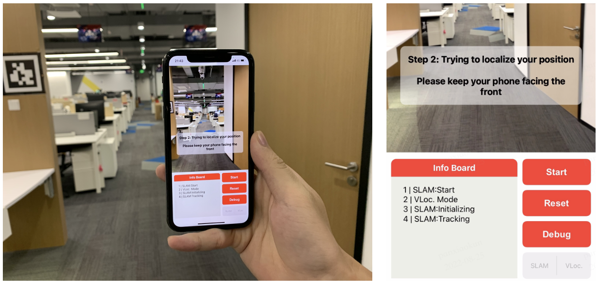

ARDemo
=======

1. introduction
-----------------
The goal of VR/AR is the seamless integration of virtual scenes and real scenes. 
In order to achieve accurate registration of virtual and real scenes, it is necessary to accurately position the 6DoF spatial pose of the display device. 
We plan to develop a set of spatial positioning technology which is tightly coupled with local positioning technology and global positioning technology. Cloud-end combined high precision real-time positioning scheme. The global positioning technology ensures the absolute accuracy of spatial positioning, and the local positioning technology ensures the real-time and local accuracy of positioning. 
The current set of ARDemo has preliminarily completed the series of basic capabilities, which can be used as a basic reference.


2. QuickStart
-----------------
To see the AR demo on your iPhone, you need to perform the following steps:

1）Data capturer on your phone 
>>>>>>>>>>>>>>>>>>>>>>>>>>>>>

Capture your own data with an iPhone. Download the capture application from TestFlight(https://testflight.apple.com/join/PBZAiZce).
It is recommended to upgrade to iOS16 or above.
Available iPhone model for the capture application:

.. image:: supported_devices.png
   :width: 1500px

Currently we recover the real-world metric scale through marker, so you need to post several (usually 2-3) AprilTag with different IDs in your room before recording data, just like the picture on the right in the figure below.
The capture application looks like the picture on the left in the figure below. Choose suitable fps and click the red button to start recording. After recording, open the folder and send the data to your personal computer through airdrop. The recorded data will be a binary file ending in '.bin'.
you can get AprilTag from: 


2）preparation
>>>>>>>>>>>>>>>>>
Before this step, make sure you have clone xrsfm successfully. See installation page in XRSfm and XRLocalization.

+ Build xrardemo_workspace

.. code-block:: bash 

    mkdir XRARdemo
    cd XRARdemo
    git clone XRSfm
    git clone XRLocalization
    mkdir rawdata # put RawData.txt here from your phone
    cd .. 
    mkdir data # unpack_collect_data path
    cd .. 
    mkdir save_reconstruction # SFM output MODEL_DIR
    cd .. 
    as below:
    └── XRARdemo
        ├── XRLocalization
        ├── XRSfm
        ├── data
        ├── rawdata
        ├── recon.sh
        └── save_reconstruction

+ Fill in the paths in recon.sh and run: bash recon.sh
before you should config the path in recon.sh

+ Deploying positioning service on your own server.

.. code-block:: bash
    cd /path/to/XRLocalization
    python run_web_server.py --map_path /path/to/reconstruction_model --port 3000

make sure you can connect to the server from your iPhone.
One way is to deploy the visual positioning service on a server with a WAN IP. The other way is setup a LAN and connect both the server and your iPhone to this LAN. To test if the connection is established, visit ```http://ip:port``` on the browser of your iPhone. You will see a 'Hello' if it is successful.

+ Build SLAM on your iPhone. Reference XRSLam doc:

3）Open AR demo on your iPhone.
>>>>>>>>>>>>>>>



**demo video** 

.. raw:: html
    
    <iframe width="400" height="600" src="//https://gitlab.bj.sensetime.com/openxrlab/xrardemo/uploads/0417a41bf63c616da3c575c190f0927f/SLAM+VL-low-2.mp4" scrolling="no" border="0" frameborder="no" framespacing="0" allowfullscreen="true"> </iframe>
  
The GUI of AR demo application looks like the following picture. You need to click the 'VLoc' button to switch to the mode with visual positioning service. To see the AR logo, click the start button. A toast labeling 'Step 1: Initializing the SLAM' will appear and you should move in a curved trajectory to make the SLAM initialize well. After that, another toast labeling 'Step 2' will replace the original one and remind you to keep your phone facing the front. In this step, the system will try to localize your 6 DoF pose through the visual positioning service. Generally, these two steps will takes no more than 3 seconds in total. After that, you can add new AR objects by tapping the screen. More details about the GUI can be found in [XRSLAM]    
