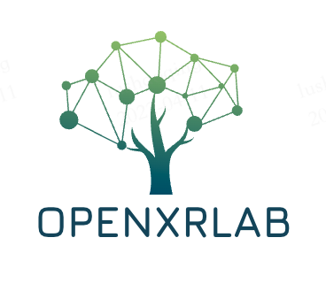

   

1. Background
-----------------
With the rise of MetaVerse, XR becomes a booming industry all around the world. However, at present, tools related to XR are relatively scattered, and there are usually problems of compatibility in practice. In order to resolve this dilemma, a set of well-integrated toolchains like OpenmmLab and HuggingFace is born on demand — **OpenXRLab**. 
OpenXRLab is an open source platform in the XR field that is built on a unified foundation and implements various application algorithms, which is easy to use independently and jointly.

2. Infrastructure
------------------------------
We expect for the content programming production for the currently commonly used OpenCV, Open3D, Pytorch3D third-party libraries to sort out, establish a unified content production
The basic function computing library is named Primer, and the code warehouse of the underlying basic computing library of OpenXRLab is established, and the sorting and interface encapsulation of the third-party library is completed. The optimization of implementation is expected to use the redefined classes and functions of the standard Primer library, which can better support XR related algorithm data opening and computing call. > Optimize some of the shortcomings and shortcomings of current open source libraries.
XRPrimer is a unified "back-end library" based on OpenCV, Open3D and Pytorch3D third-party libraries, which is a cross between PyTorch/OpenCV and other public open source libraries
The middle layer of downstream algorithm application is to provide more convenient access to third-party libraries for integration and targeted optimization. Meanwhile, it also provides more convenient tool libraries for development. At the same time, it keeps original usage habits as much as possible and provides convenient installation packages through precompilation.
XRPrimer will not do too much function encapsulation and computational reimplementation (unless the investment will improve the actual effect and efficiency).

3. Algorithm application 
------------------------
Just like the good ecology of CV, virtual reality not only builds the basic capability of the underlying computing, but also needs more access of different types of algorithm applications in the downstream to promote the continuous optimization of algorithms and underlying computing.
At present, we are actively promoting the migration of related applications such as NERF (neural rendering), MOCAP (motion capture), SFM/SLAM (localization/reconstruction) to the whole > ecosystem, and then build a complete content algorithm research and development ecosystem with interoperability of underlying computing protocols.

 We hope you all to find this platform useful and helpful!

4. OpenXRLab Framework
------------------------
.. code-block:: bash 

 +------------------------------+  +-----------------------------------------+ +-----------------------------+
 |      Spatial computing       |  |  Multi-model Huamn Computer Interaction | |           Rendering         |                                                       
 +------------------------------+  +-----------------------------------------+ +-----------------------------+
 +-------------+  +-------------+  +-------------------+ +-------------------+ +-------------+ +-------------+     
 |   XRSLAM    |  |    XRSfm    |  |   XRLocalization  | |      XRMocap      | |   XRMoGen   | |    XRNeRF   |
 +-------------+  +-------------+  +-------------------+ +-------------------+ +-------------+ +-------------+  
 +-----------------------------------------------------------------------------------------------------------+
 |                                         XR Infrastructure Platform                                        |
 +-----------------------------------------------------------------------------------------------------------+

+ XRPrimer : https://github.com/openxrlab/xrprimer
+ XRSLAM : https://github.com/openxrlab/xrslam
+ XRSfm : https://github.com/openxrlab/xrsfm 
+ XRLocalization : https://github.com/openxrlab/xrlocalization 
+ XRMocap : https://github.com/openxrlab/xrmocap
+ XRMoGen : https://github.com/openxrlab/xrmogen
+ XRNeRF : https://github.com/openxrlab/xrnerf 